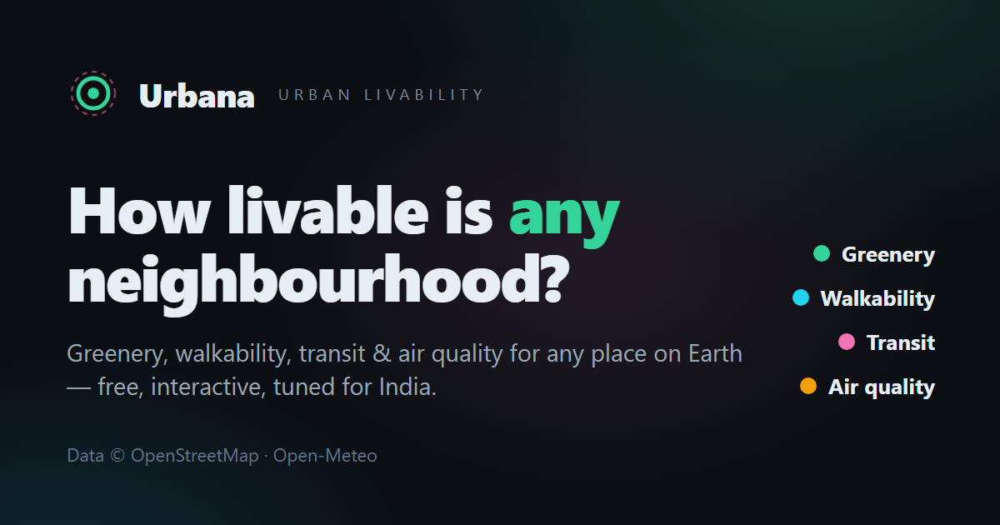

# Urbana — Urban Livability Analysis

Measure the **greenery**, **walkability**, **transit** and **air quality** of any neighbourhood on Earth from a single click on the map. Urbana runs in the browser on free, keyless open data (with a thin same-origin proxy for reliability), and is tuned to be accurate across Indian cities.



## What it does

Pick a location (search, "use my location", or click the map), choose an **analysis radius** (½ / 1 / 2 km), and Urbana scores everything around it:

| Pillar | 0–100 | Based on |
| ----- | ----- | -------- |
| **Greenery** | green **+ blue** land-cover fraction (parks, gardens, grass, woodland, rivers/lakes) + mapped trees | OpenStreetMap via Overpass |
| **Walkability** | distance-weighted, diversity-adjusted access to pharmacies, supermarkets, schools (+ Indian convenience stores, markets, clinics) | OpenStreetMap via Overpass |
| **Transit** | distance-weighted access to public transport — metro/rail & bus stations count more than lone stops | OpenStreetMap via Overpass |
| **Air quality** | inverse of ground-level PM2.5 (+ PM10, NO₂, O₃, US AQI, 24 h trend) | Open-Meteo |
| **Livability** | weighted blend (0.25 / 0.30 / 0.20 / 0.25), renormalized when a pillar is unavailable | — |

Plus: a **radar chart** of all pillars, **drill-down** POI lists (click to fly to on the map), **layer toggles** & a POI **density heatmap**, **saved places** + recent searches, live **weather** context, a downloadable **report card** (PNG), a **"how scores work"** methodology view, place search & reverse-geocoding (Nominatim), **compare mode** with a radar overlay, **shareable URLs** (`?lat=&lon=&r=`), and an installable **PWA** (offline app shell). Fully responsive with a collapsible mobile bottom sheet.

## Why it's accurate for India

- Green space leans on **polygon area** (parks/gardens/recreation grounds/woodland), because individual trees are sparsely mapped in Indian OSM data — counting only `natural=tree` would badly under-rate green Indian neighbourhoods.
- Walkability includes **convenience/kirana stores, local marketplaces and clinics** alongside the canonical pharmacy/supermarket/school, so dense-but-informal Indian retail areas aren't scored as "unwalkable".
- Air-quality bands reflect India's real PM2.5 reality (WHO/CPCB-aligned), and search is biased to India (but works worldwide).

Every scoring constant lives in [`src/config/tags.js`](src/config/tags.js) so the model is transparent and tunable — no hidden magic numbers.

## Tech

React + Vite · Tailwind CSS · react-leaflet (CARTO dark basemap) · Turf.js (geodesic areas) · Framer Motion · leaflet.heat · html-to-image · vite-plugin-pwa. Radar/sparkline are hand-rolled SVG (no charting dependency).

Data flows through two tiny **same-origin serverless proxies** ([`api/overpass.js`](api/overpass.js), [`api/geocode.js`](api/geocode.js)) so the browser never hits third-party APIs directly — this removes CORS, ad-blocker and per-client rate-limit/`406` failures. The Vite dev server mirrors both proxies so `npm run dev` behaves exactly like production.

The core is a reusable hook:

```js
const { data, loading, error, refetch } = useUrbanAnalysis(lat, lon, radius);
// data.greeneryScore, data.walkabilityScore, data.transitScore,
// data.airQualityScore, data.livabilityScore, data.breakdown, data.elements
```

It fetches Overpass + air quality + weather **in parallel**, cancels stale requests with `AbortController`, degrades gracefully if any best-effort source fails, retries across Overpass mirrors on rate-limits, and caches results in `localStorage` (keyed by coords **and** radius).

## Run locally

```bash
npm install
npm run dev      # http://localhost:5173
npm run build    # production bundle → dist/
npm run preview  # serve the production build
```

> **Note on data:** the public Overpass API is free but shared and rate-limited. Urbana automatically falls back across several mirrors and caches results for 12 h. If an analysis fails, the in-app "Try again" button retries.

## Deploy to Vercel (free)

1. Push this repo to GitHub.
2. On [vercel.com](https://vercel.com), **Add New → Project → Import** your repo.
3. Vercel auto-detects Vite (Build `npm run build`, Output `dist`). No environment variables needed.
4. Deploy. [`vercel.json`](vercel.json) adds an SPA rewrite so shared deep links (`?lat=&lon=`) resolve correctly.

To show the "view source" link in the header, set `REPO_URL` in [`src/App.jsx`](src/App.jsx).

## Data & credits

- Map data © OpenStreetMap contributors (ODbL) · Overpass API
- Basemap © CARTO
- Air quality © Open-Meteo
- Geocoding © OpenStreetMap / Nominatim

Scores are model estimates derived from open data and depend on local mapping completeness. Treat them as directional, not authoritative.
